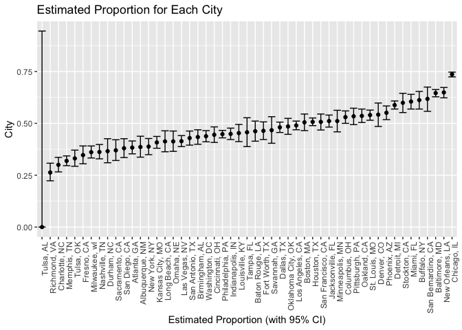
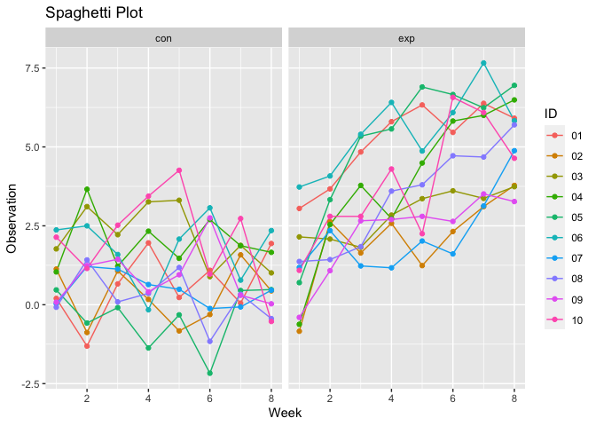
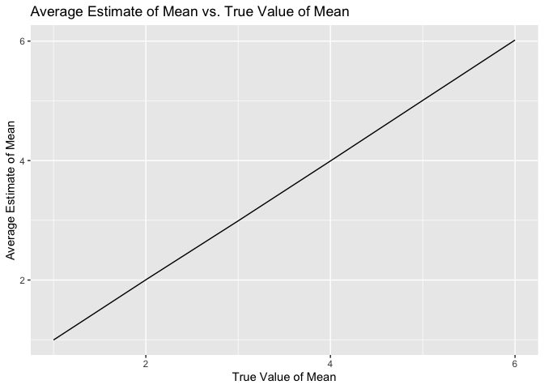
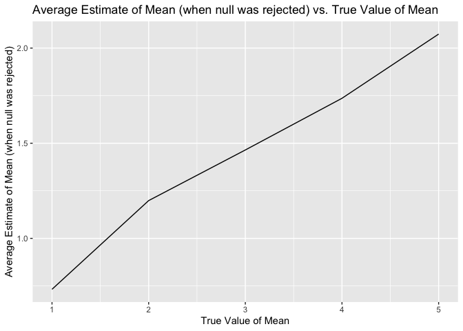

p8105_hw5_hc3451
================
Huanyu Chen
2023-11-05

# Problem 1

## Baltimore

``` r
homicide = read.csv("./homicide-data.csv")
```

The raw data contains 52179 observations of 12 variables.

``` r
homicide = homicide |>
  mutate(city_state = paste0(city,', ',state))

homicide_summary = homicide |>
  group_by(city_state) |>
  summarise(
    total_homicides = n(),
    unsolved_homicides = sum(disposition %in% c("Closed without arrest", "Open/No arrest"))
  )
homicide_summary
```

    ## # A tibble: 51 × 3
    ##    city_state      total_homicides unsolved_homicides
    ##    <chr>                     <int>              <int>
    ##  1 Albuquerque, NM             378                146
    ##  2 Atlanta, GA                 973                373
    ##  3 Baltimore, MD              2827               1825
    ##  4 Baton Rouge, LA             424                196
    ##  5 Birmingham, AL              800                347
    ##  6 Boston, MA                  614                310
    ##  7 Buffalo, NY                 521                319
    ##  8 Charlotte, NC               687                206
    ##  9 Chicago, IL                5535               4073
    ## 10 Cincinnati, OH              694                309
    ## # ℹ 41 more rows

``` r
baltimore = homicide_summary |>
  filter(city_state == "Baltimore, MD")
prop_balti = prop.test(pull(baltimore,unsolved_homicides), pull(baltimore,total_homicides),
          alternative = "two.sided",
          conf.level = 0.95, correct = TRUE) 
save(prop_balti, file = "results/unsolved_homicides_proportion.RData")
prop_tidy = broom::tidy(prop_balti)

tidy_frame = data.frame(
  city = 'Baltimore, MD',
  estimate_prop = round(as.numeric(pull(prop_tidy, estimate[1])), 3),
  confidenct_interval = paste0("(", round(pull(prop_tidy, conf.low), 3),
                               ",", round(pull(prop_tidy, conf.high), 3), ")")
  )
print(tidy_frame)
```

    ##            city estimate_prop confidenct_interval
    ## 1 Baltimore, MD         0.646       (0.628,0.663)

## Each City

``` r
prop_city = function(city) {
  homi_city = homicide_summary |>
    filter(city_state == city)
  
  prop_city = prop.test(pull(homi_city, unsolved_homicides), pull(homi_city, total_homicides),
                   alternative = "two.sided",
                   conf.level = 0.95, correct = TRUE)
  prop_city_tidy = broom::tidy(prop_city)
  
  lower_ci = round(pull(prop_city_tidy, conf.low), 3)
  upper_ci = round(pull(prop_city_tidy, conf.high), 3)
  return(data.frame(estimate_prop = round(as.numeric(pull(prop_city_tidy, estimate[1])), 3),
                    lower_ci = lower_ci,
                    upper_ci = upper_ci,
                    confidenct_interval = paste0("(", lower_ci, ",", upper_ci, ")"))
  )
}

all_cities = data.frame(city_state = unique(pull(homicide_summary, city_state)))
result_df = all_cities |>
  mutate(result = map(city_state, prop_city)) |>
  unnest(result) |>
  select(city_state, estimate_prop, confidenct_interval)
```

    ## Warning: There was 1 warning in `mutate()`.
    ## ℹ In argument: `result = map(city_state, prop_city)`.
    ## Caused by warning in `prop.test()`:
    ## ! Chi-squared approximation may be incorrect

``` r
print(result_df)
```

    ## # A tibble: 51 × 3
    ##    city_state      estimate_prop confidenct_interval
    ##    <chr>                   <dbl> <chr>              
    ##  1 Albuquerque, NM         0.386 (0.337,0.438)      
    ##  2 Atlanta, GA             0.383 (0.353,0.415)      
    ##  3 Baltimore, MD           0.646 (0.628,0.663)      
    ##  4 Baton Rouge, LA         0.462 (0.414,0.511)      
    ##  5 Birmingham, AL          0.434 (0.399,0.469)      
    ##  6 Boston, MA              0.505 (0.465,0.545)      
    ##  7 Buffalo, NY             0.612 (0.569,0.654)      
    ##  8 Charlotte, NC           0.3   (0.266,0.336)      
    ##  9 Chicago, IL             0.736 (0.724,0.747)      
    ## 10 Cincinnati, OH          0.445 (0.408,0.483)      
    ## # ℹ 41 more rows

## Graph

``` r
all_cities |>
  mutate(result = map(city_state, prop_city)) |>
  unnest(result) |>
  ggplot(aes(group = city_state, x = reorder(city_state, estimate_prop))) +
  geom_point(aes(y = estimate_prop)) +
  geom_errorbar(aes(ymin = lower_ci, ymax = upper_ci)) +
  labs(x = "Estimated Proportion (with 95% CI)", y = "City",
       title = "Estimated Proportion for Each City") +
  theme(axis.text.x = element_text(angle = 90, hjust = 1))
```

    ## Warning: There was 1 warning in `mutate()`.
    ## ℹ In argument: `result = map(city_state, prop_city)`.
    ## Caused by warning in `prop.test()`:
    ## ! Chi-squared approximation may be incorrect

<!-- -->

# Problem 2

# Problem 3

## (1) mu = 0

``` r
t_test = function(n, mu = 0, sigma = 5) {
  sim_data <- tibble(
    x = rnorm(n, mean = mu, sd = sigma)
    )
  t_test_results <- broom::tidy(t.test(sim_data))
  
  t_test_results |> 
    select(estimate, p.value)
}

sim_t_result <- tibble(
  sample_size = 30,
  iter = 1:5000
) |>
  mutate(estimate_t_test = map(sample_size, t_test)) |>
  unnest(estimate_t_test)
```

## (2) mu = 1,2,3,4,5,6

``` r
t_test = function(mu, sigma = 5) {
  sim_data <- tibble(
    x = rnorm(30, mean = mu, sd = sigma)
    )
  t_test_results <- broom::tidy(t.test(sim_data))
  
  t_test_results |> 
    select(estimate, p.value)
}

sim_t_result_1 =
  expand_grid(
    mu_values = c(1, 2, 3, 4, 5, 6),
    iter = 1:5000
  ) |> 
  mutate(estimate_t_test = map(mu_values, t_test)) |>
  unnest(estimate_t_test) |>
  group_by(mu_values) |>
  summarise(estimate = mean(estimate), power = mean(p.value< 0.05))
```

## Graph

``` r
ggplot(sim_t_result_1, aes(x = mu_values, y = power)) +
  geom_line() +
  labs(x = "True Value of Mean", y = "Power of the Test") +
  ggtitle("Power of the Test vs. True Value of Mean")
```

<!-- -->

``` r
ggplot(sim_t_result_1, aes(x = mu_values, y = estimate)) +
  geom_line() +
  labs(x = "True Value of Mean", y = "Average Estimate of Mean") +
  ggtitle("Average Estimate of Mean vs. True Value of Mean")
```

<!-- -->

``` r
sim_t_result_2 = 
  expand_grid(
    mu_values = c(1, 2, 3, 4, 5, 6),
    iter = 1:5000
  ) |> 
  mutate(estimate_t_test = map(mu_values, t_test)) |>
  unnest(estimate_t_test) |>
  group_by(mu_values) |>
  filter(p.value > 0.05) |>
  summarise(estimate = mean(estimate))

ggplot(sim_t_result_2, aes(x = mu_values, y = estimate)) +
  geom_line() +
  labs(x = "True Value of Mean", y = "Average Estimate of Mean (when null was rejected)") +
  ggtitle("Average Estimate of Mean (when null was rejected) vs. True Value of Mean")
```

<!-- -->

The sample average of mean across tests for which the null is rejected
is not approximately equal to the true value of mean. By this way, the
null will be rejected under the confidence interval.
